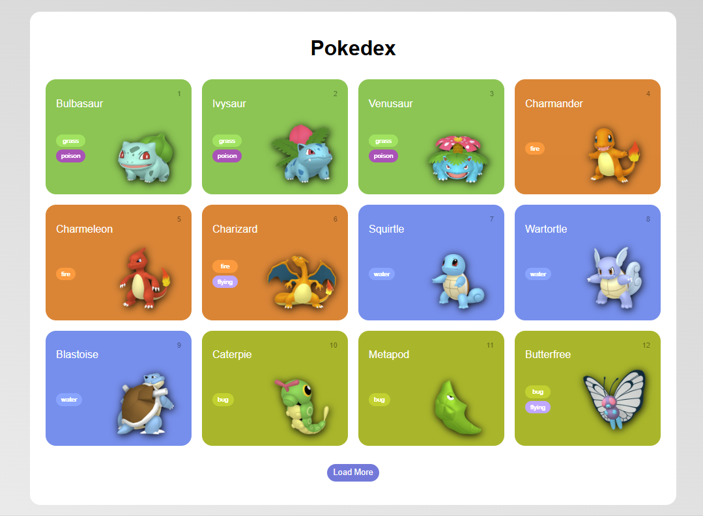

# 🧩 Pokédex

Aplicação web responsiva desenvolvida para praticar **JavaScript, consumo de APIs e manipulação dinâmica de dados**.

O projeto utiliza a **PokeAPI** para obter informações dos Pokémon e gerar dinamicamente os cards exibidos na interface.

## ✨ Funcionalidades

* 📱 Interface responsiva
* 🔌 Integração com a **PokeAPI**
* 🃏 Criação dinâmica dos cards de Pokémon
* 🖼️ Exibição de imagens dos Pokémon
* 🏷️ Exibição de número, nome e tipos
* ➕ Carregamento incremental de novos Pokémon
* ⚡ Processamento de múltiplas requisições utilizando `Promise.all()`

## 🛠️ Tecnologias

* HTML5
* CSS3
* JavaScript
* PokeAPI

## 📸 Preview



## 🔌 Integração com a PokeAPI

A aplicação realiza requisições à **PokeAPI** para obter os dados dos Pokémon.

Os dados recebidos são processados pelo JavaScript e utilizados para gerar dinamicamente os elementos da interface.

```text
PokeAPI
   ↓
Requisição HTTP
   ↓
JavaScript
   ↓
Processamento dos dados
   ↓
Cards dos Pokémon
   ↓
Interface
```

Entre as informações utilizadas estão:

* Número do Pokémon
* Nome
* Tipos
* Imagem

## ➕ Carregamento incremental

A aplicação utiliza um sistema de carregamento incremental para evitar que todos os registros sejam carregados de uma só vez.

Ao clicar no botão **"Load More"**, uma nova quantidade de Pokémon é solicitada à API e adicionada à lista existente.

O carregamento utiliza os parâmetros `offset` e `limit` para controlar os registros retornados pela API.

```text
Carregamento inicial
        ↓
Lista de Pokémon
        ↓
"Load More"
        ↓
Nova requisição
        ↓
Novos Pokémon adicionados
```

## ⚙️ Organização do código

O JavaScript foi separado em arquivos com responsabilidades diferentes:

```text
assets/
└── js/
    ├── main.js
    ├── poke-api.js
    └── pokemon-model.js
```

### `main.js`

Responsável pelo funcionamento da interface, interação com o usuário e atualização dos elementos da página.

### `poke-api.js`

Responsável pela comunicação com a PokeAPI e pelas requisições dos dados.

### `pokemon-model.js`

Responsável pela estrutura dos objetos utilizados para representar os Pokémon.

## 🎯 Objetivos do projeto

O projeto foi desenvolvido para praticar:

* Consumo de APIs REST
* Requisições HTTP utilizando `fetch()`
* Programação assíncrona com JavaScript
* Utilização de `Promise.all()`
* Manipulação e transformação de dados
* Criação dinâmica de elementos HTML
* Manipulação do DOM
* Organização de código JavaScript
* Desenvolvimento de interfaces responsivas

## 📚 Aprendizados

Durante o desenvolvimento, foram praticados conceitos de **integração com APIs externas, programação assíncrona e manipulação dinâmica do DOM**.

O projeto também proporcionou experiência na transformação de dados recebidos de uma API em elementos visuais e na implementação de um sistema de carregamento incremental para melhorar a experiência do usuário.

## 👨‍💻 Autor

**João Victor Farias Zock**

[](https://github.com/joaozock)

[](https://www.linkedin.com/in/joaozock/)
